# LLM-Centered Architecture

Lion Kimbro - 2025-03-22 - Composed with ChatGPT, Mermaid diagrams via Claude 3.7 Sonnet Thinking.

## Key Visualizations

### 1. Core Architecture - Simple Overview

```mermaid
graph TD
    User[👤 User]
    LLM[🧠 LLM]
    Body[⚙️ The Body]
    World[🌐 External World]
    
    User <--"Natural language"--> Body
    Body <--"Prompts & Context"--> LLM
    LLM <--"Commands & Explanations"--> Body
    Body <--"API calls/Actions"--> World
    
```

### 2. Typical User Interaction Flow

### 3. System Growth Process

```mermaid
graph TD
    Start[🌱 Minimal System]
    Mid[🌿 Growing System]
    End[🌳 Mature System]
    
    Start --> |"User requests capability"| A1[Add first tool]
    A1 --> |"LLM proposes enhancement"| A2[Add UI improvement]
    A2 --> |"User needs security"| A3[Add authorization layer]
    A3 --> Mid
    
    Mid --> |"LLM suggests integration"| B1[Add external API]
    B1 --> |"User requests automation"| B2[Add scheduled tasks]
    B2 --> |"Performance needs"| B3[Optimize tool access]
    B3 --> End
    
    
    style Start fill:#ffe6cc,stroke:#d79b00
    style Mid fill:#d5e8d4,stroke:#82b366  
    style End fill:#dae8fc,stroke:#6c8ebf
```

## Overview

Most traditional software architectures revolve around user interfaces that define a fixed set of inputs: buttons, forms, commands, and gestures. Each action triggers predetermined responses, and the behavior of the program is tightly coupled to the structure of that interface.

LLM-Centered Architecture introduces a new paradigm: placing a Large Language Model at the heart of the system, not as an add-on, but as the central orchestrator. In this model, users can communicate with the system using natural language, and the LLM interprets intent, chooses tools, executes actions, and explains results. The LLM is not programmed in the traditional sense, but prompted — its behavior emerges from a combination of conversation, context, and access to system capabilities.

The user interacts with the program in two complementary ways:

- **Conversationally**, through the LLM, via some mechanical interface (e.g., a text input box, terminal, GUI entry field, or microphone)
- **Directly**, through manual controls, files, scripts, or system interfaces

The LLM receives all input as plain text — including user prompts and structured messages from the Body. These might include system events, context updates, or user actions encoded in a recognizable form.

Its responses are also plain text, but may contain multiple layers:

- Messages meant for the user, written in natural language
- Structured tool commands or instructions, which the Body parses and executes

The Body handles the routing and interpretation, making it possible for a single output to both inform the user and trigger tools.
The LLM interfaces with a suite of structured tools — predictable, modular actions that can be triggered on behalf of the user — and optionally with externally-defined systems that exist outside the Body of the program. The system is designed so that all tooling exists in service of the LLM's capacity to reason, act, and explain.

---

## Core Components

### 1. **User**

- The user is a full participant in the system
- Communicates through interfaces built into the Body (e.g., keyboard, mouse, microphone, text inputs)
- Can also act directly on the system or its environment, outside the LLM's awareness
- Engages in dialogue with the LLM to drive intent, review proposals, and approve or deny actions

### 2. **LLM Agent**

- Acts within the system as a reasoning, conversational agent
- Interprets user goals and selects actions based on system state and available tools
- Communicates via:
  - Natural language explanation
  - Structured responses such as reports or formatted output
- Has no direct control — all actions must pass through the Body

### 3. **The Body**

The Body is the mechanical, rule-bound core of the system that mediates between the User, the LLM, and the outside World.

#### a. **Tools**

- A suite of deterministic, pre-programmed tools the LLM can call
- Examples: `DB`, `DISPLAY`, `TALK`, `MSG`, etc.
- Each tool is bounded, discoverable, and documented

#### b. **Shell / Environment Access**

- Mechanisms for interacting with systems external to the program
- Includes: command shells, web requests, APIs, filesystems, remote resources
- Must be explicitly enabled and are subject to sandboxing or review

#### c. **Command Authorization**

- Any potentially risky action is intercepted for user review
- LLM explains intent and the command being proposed
- User may approve, reject, or request clarification
- May optionally involve a second neutral agent for verifying commands

#### d. **Display and Interface**

- The expressive voice and visual face of the system
- Routes responses from the LLM to the user
- Collects input, triggers tools, and logs interactions

### 4. **The World (External Systems)**

- Anything not owned by the program itself
- Includes: operating system, browser, network resources, remote databases, and the internet
- The Body selectively grants access to the World via tools or special permissions

---

## The Role of the Body Programmer

The human developer does not program the LLM, the User, or the World. Instead, they design and construct the **Body** — the part of the system that houses tools, manages input and output, enforces permissions, and orchestrates interaction.

The Body Programmer:

- Builds the tools and APIs the LLM can invoke
- Defines the structure and channels through which the user communicates
- Implements safety, authorization, and sandboxing layers
- Provides structured inputs to the LLM and structured outputs from it
- Designs the visual and interactive presentation of the system
- Maintains the integrity of the contract between user, LLM, and world

This role is one of **ongoing co-development**: as the LLM proposes changes, improvements, or new capabilities, the Body Programmer collaborates to implement or evolve the system accordingly.

## The Role of the LLM

The LLM is not a hardcoded engine — it is a reasoning agent that operates within the system, responding to prompts, generating language, and guiding system behavior through natural dialog.

The LLM:

- Receives structured prompts and context through the Body
- Interprets user intent and system state
- Chooses from available tools or proposes actions
- Explains, summarizes, or narrates what it is doing
- Produces structured data or command outputs for execution

The LLM does not act independently. Its reach is mediated by the Body, and its ability to affect the system or environment is shaped by the tooling, permissions, and communication pathways provided by the Body Programmer.

Its strength is not in execution, but in cognition, guidance, and articulation.

---

## Bootstrapping Process

The LLM-centered architecture allows for a unique kind of system development: one where the LLM actively participates in the creation of its own environment.

The system begins with a minimal Body — just enough to invoke the LLM and receive inputs and outputs.

From this starting point, the user and LLM collaborate: the user asks questions, the LLM proposes code, tools, or configurations to expand its own capabilities.

New tools, interfaces, and safety layers are added incrementally, based on dialog.

Over time, the Body becomes more complex, guided by the LLM’s evolving sense of what it can do and what it needs.

This process emphasizes collaborative emergence: a program grown through interaction, rather than predefined all at once.

---

## Conclusion

We build software to help us do work, learn things, and communicate. These goals remain the same, but the way we achieve them is shifting. Now, programs can contain a reasoning intelligence — not just reactive logic, but something that can observe, adapt, and assist.

To make full use of that, we must structure our software differently. We must expose meaningful tools, state, and capabilities to that internal intelligence — not bury it behind narrow inputs and frozen interfaces. Programs become more powerful when the intelligence inside them can take action on our behalf, and collaborate with us in the process of building, exploring, and learning.

This architecture is about enabling that. It provides a framework for how to build software that allows intelligent agents to help us — not by replacing us, but by working alongside us.
